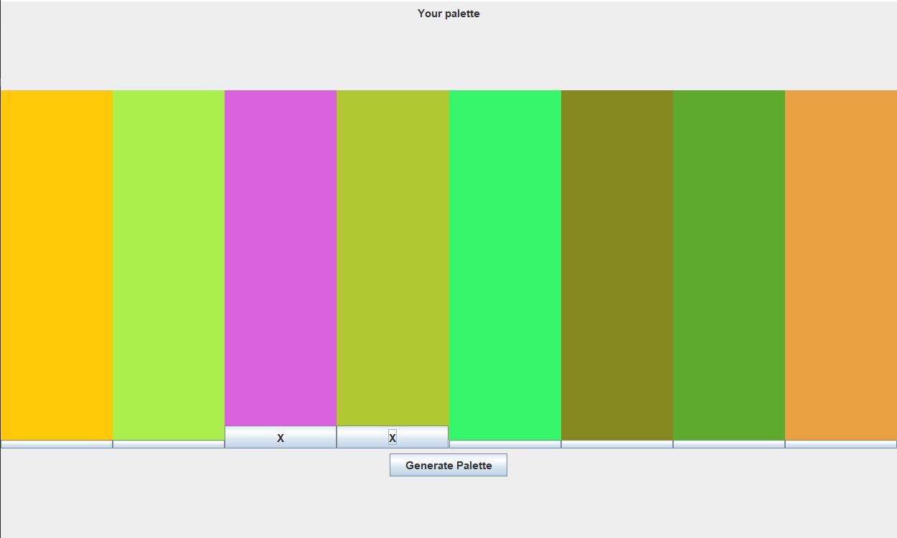

# Palette Generator

by Bardia Parmoun


## DESCRIPTION
- This repository simulates a simple palette generator that can create random colours

## COMPILING
- First you need to compile all the class files using:
```
javac Main.java PaletteGenerator.java
```

Then run the program using:
```
java PaletteGenerator
```
## USAGE
- The palette consists of 8 panel each containing their own colour. 
- There is a button under each panel which can be used to lock that panel (marked with an X) so the colour of that panel will remain unchanged.
- The generate palette button can be used to generate 8 new colours. 

## Examples

- Here is an example palette:
- 
<p align="center">

</p>


## CREDITS
Author: Bardia Parmoun

Copyright © 2021 Bardia Parmoun. All rights reserved
